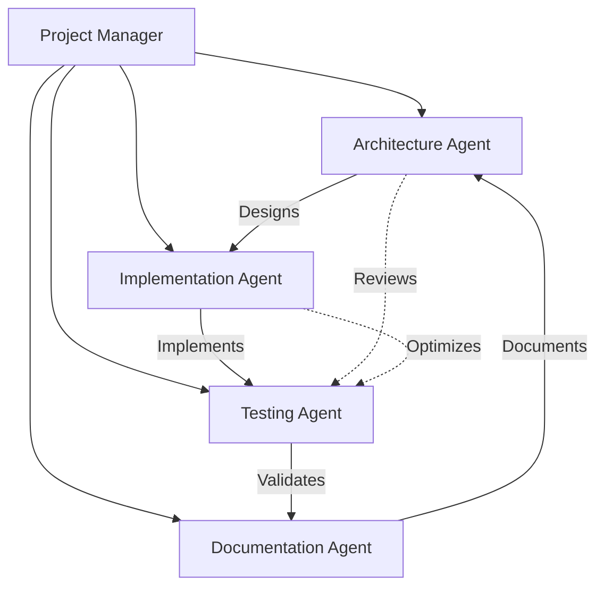

# FP++20 Project Roadmap

## Executive Summary

FP++20 is an ambitious C++20 header-only library that brings Haskell's elegant functional programming abstractions to modern C++. This roadmap outlines our strategic approach to implementing core FP concepts including Monad, Functor, Applicative, and advanced type system features, while maintaining C++ idioms and zero-cost abstractions.

**Timeline**: 6-12 months to production-ready v1.0
**Current Phase**: Sprint 1 - Monad Implementation
**Methodology**: Test-Driven Development with strict CI/CD enforcement

## Vision & Mission

### Vision
To become the definitive functional programming library for C++20, enabling developers to write more expressive, safer, and composable code by leveraging proven FP abstractions within C++'s type system.

### Mission
- Bridge the gap between Haskell's theoretical elegance and C++'s practical performance
- Provide compile-time type safety through C++20 concepts
- Maintain zero-overhead abstractions
- Create comprehensive documentation and examples for C++ developers new to FP

## Strategic Goals (6-12 Months)

### Q1 2025 (Months 1-3): Foundation
- ✅ Complete Monad abstraction with Maybe and Result types
- Implement Functor with fmap and operator overloads
- Deploy Applicative with pure and apply operations
- Establish comprehensive test suite and documentation patterns

### Q2 2025 (Months 4-6): Expansion
- Add advanced monads (State, Reader, Writer)
- Implement Foldable and Traversable abstractions
- Create monad transformers for composition
- Release v0.5 beta with core functionality

### Q3 2025 (Months 7-9): Optimization
- Performance benchmarking and optimization
- Template instantiation reduction
- Compile-time optimization
- Integration with existing C++ codebases examples

### Q4 2025 (Months 10-12): Production Ready
- Final API stabilization
- Comprehensive documentation and tutorials
- Industry case studies
- v1.0 release with long-term support commitment

## Epic Overview

### Epic 1: Monad Implementation (Current - 2 weeks)
**Goal**: Establish the foundational Monad abstraction with practical implementations

**Key Deliverables**:
- Monad concept definition with bind, return, and fail
- Maybe<T> monad with complete operations
- Result<T, E> monad for error handling
- Monad laws verification through static_assert
- Comprehensive test coverage

### Epic 2: Functor Abstraction (Weeks 3-4)
**Goal**: Implement the Functor type class as the base for all container-like abstractions

**Key Deliverables**:
- Functor concept with fmap
- STL container adaptations (vector, optional, variant)
- Custom functor examples
- Functor composition utilities
- Property-based testing

### Epic 3: Applicative Interface (Weeks 5-6)
**Goal**: Bridge between Functor and Monad with Applicative's multi-parameter function application

**Key Deliverables**:
- Applicative concept with pure and apply
- Operator overloads (<*>, <*, *>)
- Lifting functions (liftA2, liftA3)
- Validation applicative for error accumulation
- Applicative laws verification

### Epic 4: Advanced Monads (Weeks 7-10)
**Goal**: Implement practical monads for real-world applications

**Key Deliverables**:
- State monad for stateful computations
- Reader monad for dependency injection
- Writer monad for logging
- Continuation monad for control flow
- List monad for non-deterministic computation

### Epic 5: Type System Extensions (Weeks 11-14)
**Goal**: Advanced FP concepts and type-level programming

**Key Deliverables**:
- Foldable and Traversable abstractions
- Alternative and MonadPlus for choice
- Free monads for DSL construction
- Type-level programming utilities
- Compile-time reflection capabilities

## Sprint 1 Details (Current Sprint)

### Sprint Goal
Deliver a production-quality Monad abstraction with Maybe and Result implementations, establishing patterns for all future FP abstractions.

### User Stories

#### Story 1: Monad Concept Definition [COMPLETED]
- **Acceptance Criteria**:
  - ✅ Define monad concept with requires clauses
  - ✅ Support bind, return, and fail operations
  - ✅ Compile-time type checking
- **Technical Notes**: Uses C++20 concepts for type constraints

#### Story 2: Maybe Monad Implementation [IN PROGRESS]
- **Acceptance Criteria**:
  - ✅ Complete Maybe<T> with Some/None variants
  - ✅ Implement bind, map, and combinators
  - ✅ Support chaining operations
  - ⏳ Add comprehensive tests
- **Technical Notes**: Focus on ergonomic API design

#### Story 3: Result Monad Implementation [PENDING]
- **Acceptance Criteria**:
  - Define Result<T, E> for error handling
  - Implement Ok/Err variants
  - Support error propagation patterns
  - Provide try_catch interop
- **Effort**: Medium
- **Dependencies**: Maybe monad patterns

#### Story 4: Monad Laws Verification [PENDING]
- **Acceptance Criteria**:
  - Static verification of left identity
  - Static verification of right identity
  - Static verification of associativity
  - Runtime property tests
- **Effort**: Small
- **Dependencies**: Maybe and Result implementations

#### Story 5: Documentation and Examples [PENDING]
- **Acceptance Criteria**:
  - API documentation with Doxygen
  - Tutorial for C++ developers
  - Real-world usage examples
  - Migration guide from exceptions
- **Effort**: Medium
- **Dependencies**: All monad implementations

### Sprint Velocity
- **Planned**: 5 story points
- **Completed**: 2 story points
- **Remaining**: 3 story points
- **Timeline**: On track for 2-week completion

## Future Sprints Preview

### Sprint 2: Functor Foundation
- Functor concept definition
- fmap implementation strategy
- STL container adaptations
- Functor composition

### Sprint 3: Applicative Power
- Applicative concept
- Pure and apply operations
- Operator overloads
- Validation patterns

### Sprint 4: Advanced Monads Part 1
- State monad
- Reader monad
- Practical examples

### Sprint 5: Advanced Monads Part 2
- Writer monad
- Continuation monad
- List monad

## Technical Strategy

### Core Principles

#### 1. Type Safety First
```cpp
template<typename T>
concept Monad = requires(T m) {
    typename T::value_type;
    { T::pure(std::declval<typename T::value_type>()) } -> std::same_as<T>;
    { m.bind(std::declval<std::function<T(typename T::value_type)>>()) } -> std::same_as<T>;
};
```

#### 2. Zero-Cost Abstractions
- All operations inline-able
- No virtual functions
- Compile-time optimization
- Template instantiation management

#### 3. C++ Idioms
- RAII compliance
- Move semantics optimization
- Perfect forwarding
- Expression templates where beneficial

#### 4. Compile-Time Verification
- Concept constraints
- Static assertions for laws
- SFINAE for backward compatibility
- Requires clauses for clear errors

### Implementation Architecture

```
include/fp20/
├── concepts/
│   ├── monad.hpp
│   ├── functor.hpp
│   └── applicative.hpp
├── types/
│   ├── maybe.hpp
│   ├── result.hpp
│   └── either.hpp
├── combinators/
│   ├── bind.hpp
│   ├── map.hpp
│   └── apply.hpp
└── utils/
    ├── type_traits.hpp
    └── function_traits.hpp
```

## Agent Team Structure

### Recommended Agent Roles

#### 1. Architecture Agent
- **Responsibilities**: API design, concept definitions, type system architecture
- **Skills**: C++20 concepts, template metaprogramming, FP theory
- **Deliverables**: Interface specifications, design documents

#### 2. Implementation Agent
- **Responsibilities**: Core type implementations, performance optimization
- **Skills**: Modern C++, move semantics, expression templates
- **Deliverables**: Header implementations, inline optimizations

#### 3. Testing Agent
- **Responsibilities**: Test suite, property testing, law verification
- **Skills**: GoogleTest, property-based testing, static assertions
- **Deliverables**: Comprehensive test coverage, CI/CD integration

#### 4. Documentation Agent
- **Responsibilities**: API docs, tutorials, migration guides
- **Skills**: Technical writing, Doxygen, markdown
- **Deliverables**: User guides, API references, examples

### Collaboration Model



## Risk Assessment & Mitigation

### Technical Risks

| Risk | Impact | Probability | Mitigation |
|------|--------|-------------|------------|
| Compile-time explosion | High | Medium | Template instantiation limits, explicit instantiation |
| API breaking changes | High | Low | Semantic versioning, deprecation policy |
| Performance regression | Medium | Medium | Continuous benchmarking, optimization guides |
| Concept compatibility | Medium | Low | Fallback SFINAE, compatibility layer |

### Project Risks

| Risk | Impact | Probability | Mitigation |
|------|--------|-------------|------------|
| Scope creep | High | High | Strict epic boundaries, change control |
| Documentation lag | Medium | High | Documentation-first approach, automated generation |
| Adoption barriers | High | Medium | Migration guides, incremental adoption path |
| Maintenance burden | Medium | Low | Automated testing, clear ownership model |

## Success Metrics

### Technical Metrics
- **Compile-time**: < 1s for basic monad operations
- **Runtime performance**: Zero overhead vs hand-written code
- **Template instantiations**: < 100 per translation unit
- **Code coverage**: > 95% line coverage
- **Static assertions**: 100% law verification

### Project Metrics
- **Sprint velocity**: 5-7 story points per sprint
- **Documentation coverage**: 100% public API documented
- **Example coverage**: 2+ examples per major concept
- **Compiler support**: GCC 10+, Clang 12+, MSVC 2022+
- **Build time**: < 30s for full test suite

### Adoption Metrics
- **GitHub stars**: 100+ in first 6 months
- **Contributors**: 5+ active contributors
- **Industry adoption**: 2+ production deployments
- **Conference talks**: 1+ major C++ conference presentation
- **Blog posts**: 10+ tutorial articles

## Milestones & Deliverables

### Milestone 1: Foundation (Week 2)
- ✅ Monad abstraction complete
- ✅ Maybe monad operational
- ⏳ Result monad functional
- ⏳ Basic documentation

### Milestone 2: Core Abstractions (Week 6)
- Functor implementation
- Applicative implementation
- STL integration
- Tutorial series started

### Milestone 3: Beta Release (Week 10)
- Advanced monads complete
- Performance benchmarks
- Migration guides
- v0.5 beta release

### Milestone 4: Extended Features (Week 14)
- Foldable/Traversable
- Monad transformers
- Free monads
- v0.8 release candidate

### Milestone 5: Production Ready (Week 24)
- Full documentation
- Industry case studies
- Performance guarantees
- v1.0 release

## Appendix A: Technology Stack

- **C++ Standard**: C++20 (concepts, ranges, coroutines)
- **Build System**: CMake 3.20+
- **Testing**: GoogleTest + custom property testing
- **CI/CD**: GitHub Actions
- **Documentation**: Doxygen + Sphinx
- **Benchmarking**: Google Benchmark
- **Static Analysis**: clang-tidy, cppcheck

## Appendix B: Coding Standards

- **Style Guide**: Modified Google C++ Style Guide
- **Naming**: snake_case for functions, PascalCase for types
- **Headers**: Include guards + pragma once
- **Documentation**: Doxygen comments for all public APIs
- **Testing**: One test file per header
- **Examples**: One example per major feature

## Appendix C: Version History

| Version | Date | Description |
|---------|------|-------------|
| 0.0.1 | 2025-01 | Initial Monad implementation |
| 0.1.0 | TBD | Functor and Applicative |
| 0.5.0 | TBD | Beta release with advanced monads |
| 0.8.0 | TBD | Release candidate |
| 1.0.0 | TBD | Production release |

---

*This document is a living roadmap and will be updated as the project evolves. For the latest status, see the project board and sprint tracking.*

**Last Updated**: January 2025
**Next Review**: End of Sprint 1
**Document Owner**: Project Manager