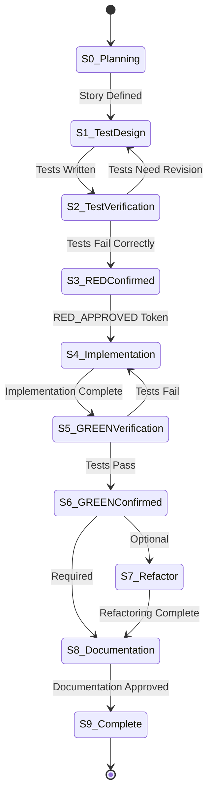
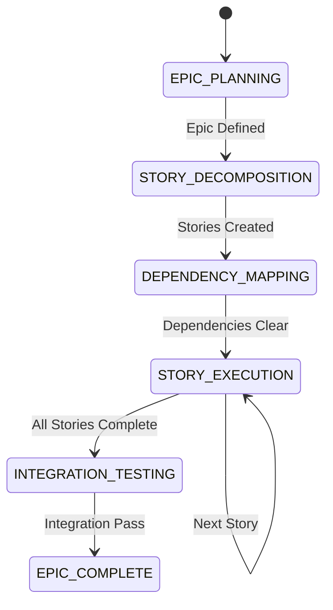
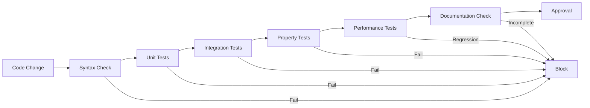

# Workflow Patterns Documentation

## Table of Contents
1. [Introduction & Philosophy](#introduction--philosophy)
2. [Core Workflow States](#core-workflow-states)
3. [Pattern 1: NEW FEATURE (Standard TDD)](#pattern-1-new-feature-standard-tdd)
4. [Pattern 2: ARCHITECTURAL REFACTOR](#pattern-2-architectural-refactor)
5. [Pattern 3: BUG FIX](#pattern-3-bug-fix)
6. [Epic-Level Workflows](#epic-level-workflows)
7. [Law Testing Workflows](#law-testing-workflows)
8. [Multi-Agent Coordination Protocols](#multi-agent-coordination-protocols)
9. [Quality Gates & Checkpoints](#quality-gates--checkpoints)
10. [Story Templates](#story-templates)
11. [Continuous Validation](#continuous-validation)
12. [Best Practices](#best-practices)

---

## Introduction & Philosophy

This document defines the formalized workflow patterns for the FP++20 project, ensuring consistent TDD discipline, proper agent coordination, and high-quality C++20 implementations of functional programming concepts.

### Core Principles

1. **Test-Driven Development (TDD)**: No production code without failing tests
2. **Agent Specialization**: Each agent has a specific role and expertise
3. **Workflow Integrity**: No steps can be skipped; all checkpoints must pass
4. **Continuous Validation**: Every change is validated at multiple levels
5. **Documentation-as-Code**: Documentation is part of the implementation

### Workflow Philosophy

Our workflows enforce a strict discipline where:
- **Planning precedes coding**: Every implementation starts with a clear story
- **Tests precede implementation**: Every feature starts with failing tests
- **Quality gates are mandatory**: No bypassing of checkpoints
- **Coordination is explicit**: Agent handoffs are clearly defined

---

## Core Workflow States

### State Model



### State Definitions

| State | Name | Prerequisites | Allowed Agents | Outputs |
|-------|------|--------------|----------------|---------|
| S0 | Planning | None | haskell-cpp-project-manager, agent-team-optimizer | Story definition with acceptance criteria |
| S1 | Test Design | Story defined | cpp20-test-first-writer | Failing test cases |
| S2 | Test Verification | Tests written | tdd-enforcer (Checkpoint 1) | RED phase validation |
| S3 | RED Confirmed | Tests fail correctly | cpp20-expert, haskell-to-cpp20-translator | Implementation plan |
| S4 | Implementation | RED_APPROVED token | cpp20-expert | Production code |
| S5 | GREEN Verification | Implementation exists | tdd-enforcer (Checkpoint 2) | GREEN phase validation |
| S6 | GREEN Confirmed | Tests pass | cpp20-expert (optional) | GREEN_APPROVED token |
| S7 | Refactor (Optional) | GREEN_APPROVED | cpp20-expert | Refactored code |
| S8 | Documentation | Tests passing | documentation-quality-guardian | Complete documentation |
| S9 | Complete | All checkpoints passed | haskell-cpp-project-manager | Story marked complete |

---

## Pattern 1: NEW FEATURE (Standard TDD)

### Overview
The standard TDD workflow for implementing new functional programming concepts in C++20.

### Workflow Sequence

```
1. PLANNING
   Agent: haskell-cpp-project-manager
   Input: Feature request
   Output: Story FUNC-XXX with acceptance criteria
   Guard: Story must have testable criteria

2. TEST DESIGN (RED Phase Start)
   Agent: cpp20-test-first-writer
   Input: Story acceptance criteria
   Output: Failing test suite
   Guard: No implementation exists

3. TEST VERIFICATION
   Agent: tdd-enforcer (Checkpoint 1)
   Input: Test compilation output, test run results
   Output: RED_APPROVED or REVISION_REQUIRED
   Guard: Tests must fail for the right reasons

4. IMPLEMENTATION (GREEN Phase)
   Agent: cpp20-expert OR haskell-to-cpp20-translator
   Input: Failing tests, story requirements
   Output: Minimal implementation
   Guard: Must have RED_APPROVED token

5. GREEN VERIFICATION
   Agent: tdd-enforcer (Checkpoint 2)
   Input: Test run results with implementation
   Output: GREEN_APPROVED or REVISION_REQUIRED
   Guard: All tests must pass

6. REFACTOR (Optional)
   Agent: cpp20-expert
   Input: Passing tests, code review
   Output: Refactored implementation
   Guard: Tests must remain green

7. DOCUMENTATION
   Agent: documentation-quality-guardian
   Input: Implementation, tests
   Output: Complete documentation
   Guard: Code must be stable (tests passing)

8. COMPLETION
   Agent: haskell-cpp-project-manager
   Input: All artifacts
   Output: Story marked complete, commit created
   Guard: All checkpoints passed
```

### Example: Implementing Functor (FUNC-001)

```yaml
Story: FUNC-001 - Implement Functor concept
Acceptance Criteria:
  - Functor concept defined in C++20
  - fmap function template works for standard containers
  - Laws verified through property tests

Test First (RED):
  - test_functor_concept_definition.cpp
  - test_functor_fmap_vector.cpp
  - test_functor_laws.cpp

Implementation (GREEN):
  - concepts/functor.hpp
  - Minimal fmap for std::vector

Refactor:
  - Extract common type traits
  - Optimize fmap implementation

Documentation:
  - Concept documentation
  - Usage examples
  - Law explanations
```

---

## Pattern 2: ARCHITECTURAL REFACTOR

### Overview
For large-scale refactoring that affects multiple components while maintaining all tests.

### Workflow Sequence

```
1. REFACTOR PLANNING
   Agent: cpp20-expert + agent-team-optimizer
   Input: Current architecture analysis
   Output: Refactor plan with risk assessment
   Guard: All current tests must be passing

2. SAFETY NET CREATION
   Agent: cpp20-test-first-writer
   Input: Refactor plan, risk areas
   Output: Additional characterization tests
   Guard: Must cover all affected areas

3. INCREMENTAL REFACTORING
   For each component:
   a. Agent: cpp20-expert
      Input: Component, refactor plan
      Output: Refactored component
      Guard: Tests remain green

   b. Agent: tdd-enforcer (Incremental Check)
      Input: Test results
      Output: CONTINUE or ROLLBACK
      Guard: No test regression

4. INTEGRATION VERIFICATION
   Agent: tdd-enforcer (Integration Check)
   Input: All component test results
   Output: INTEGRATION_APPROVED
   Guard: All integration tests pass

5. PERFORMANCE VALIDATION
   Agent: cpp20-expert
   Input: Benchmarks
   Output: Performance report
   Guard: No significant regression

6. DOCUMENTATION UPDATE
   Agent: documentation-quality-guardian
   Input: Architectural changes
   Output: Updated architecture docs
   Guard: Docs match new structure
```

### Example: FP-003 Maybe Monad Refactor

```yaml
Refactor: FP-003 - Optimize Maybe monad
Risk Areas:
  - Type deduction changes
  - Move semantics
  - Constexpr compatibility

Safety Tests Added:
  - test_maybe_move_semantics.cpp
  - test_maybe_type_deduction.cpp
  - test_maybe_constexpr.cpp

Components Refactored (in order):
  1. maybe_storage.hpp (internal storage)
  2. maybe_operators.hpp (monadic operations)
  3. maybe_utils.hpp (helper functions)

Validation:
  - All 47 tests remain green
  - 15% performance improvement
  - No API breaking changes
```

---

## Pattern 3: BUG FIX

### Overview
TDD approach to fixing bugs: reproduce with test, then fix.

### Workflow Sequence

```
1. BUG REPRODUCTION
   Agent: cpp20-test-first-writer
   Input: Bug report
   Output: Failing test that reproduces bug
   Guard: Test must fail consistently

2. BUG VERIFICATION
   Agent: tdd-enforcer (Bug Checkpoint)
   Input: Failing test demonstrating bug
   Output: BUG_CONFIRMED
   Guard: Bug is reproducible

3. FIX IMPLEMENTATION
   Agent: cpp20-expert
   Input: Failing test, bug analysis
   Output: Bug fix
   Guard: Must have BUG_CONFIRMED

4. FIX VERIFICATION
   Agent: tdd-enforcer (Fix Checkpoint)
   Input: Test results after fix
   Output: FIX_APPROVED
   Guard: Bug test passes, no regression

5. REGRESSION PREVENTION
   Agent: cpp20-test-first-writer
   Input: Bug context
   Output: Additional edge case tests
   Guard: Related functionality covered

6. DOCUMENTATION
   Agent: documentation-quality-guardian
   Input: Bug fix, test cases
   Output: Updated docs, known issues
   Guard: Fix is documented
```

### Example: BUG-001 Template Deduction Failure

```yaml
Bug: BUG-001 - fmap fails type deduction with const containers
Reproduction Test:
  - test_fmap_const_vector_bug.cpp (RED)

Fix:
  - Updated functor.hpp with better SFINAE
  - Added const-qualified overloads

Regression Tests:
  - test_fmap_const_correctness.cpp
  - test_fmap_cv_qualifiers.cpp

Result:
  - Original bug fixed
  - 5 new edge cases covered
  - No performance impact
```

---

## Epic-Level Workflows

### Overview
Managing large features that span multiple stories with complex dependencies.

### Epic State Model



### Epic Coordination Protocol

```yaml
EPIC_START:
  Coordinator: workflow-coordinator
  Agents: haskell-cpp-project-manager, agent-team-optimizer
  Output: Epic plan with story breakdown

STORY_BATCH_PLANNING:
  Parallel Stories: Identify independent work
  Sequential Stories: Define dependency chain
  Risk Assessment: Critical path analysis

STORY_EXECUTION:
  For each story batch:
    - Execute Pattern 1 (NEW FEATURE) per story
    - Continuous integration checks
    - Cross-story validation

INTEGRATION_CHECKPOINT:
  Agent: tdd-enforcer (Epic Checkpoint)
  Input: All story test results
  Output: EPIC_INTEGRATED
  Guard: All cross-story tests pass

EPIC_COMPLETION:
  Documentation: Complete concept guide
  Examples: Working code samples
  Performance: Benchmark suite
```

### Example: EPIC-001 Monad Transformer Stack

```yaml
Epic: EPIC-001 - Complete Monad Transformer Stack
Stories:
  Independent Batch 1:
    - FUNC-010: StateT transformer
    - FUNC-011: ReaderT transformer
    - FUNC-012: WriterT transformer

  Sequential Chain:
    - FUNC-013: Transformer type class (depends on above)
    - FUNC-014: Lift operations
    - FUNC-015: Stack composition

Integration Tests:
  - test_transformer_stack_composition.cpp
  - test_transformer_law_preservation.cpp
  - test_transformer_performance.cpp
```

---

## Law Testing Workflows

### Overview
Special workflow for validating mathematical laws (Functor laws, Monad laws, etc.)

### Law Testing Protocol

```yaml
LAW_DEFINITION:
  Agent: haskell-to-cpp20-translator
  Input: Formal law specification
  Output: C++20 property test template

PROPERTY_GENERATION:
  Agent: cpp20-test-first-writer
  Input: Law template, type constraints
  Output: QuickCheck-style property tests

LAW_VERIFICATION:
  Agent: tdd-enforcer (Law Checkpoint)
  Input: Property test results (1000+ cases)
  Output: LAW_VERIFIED
  Guard: All properties hold

COUNTEREXAMPLE_HANDLING:
  If law fails:
    1. Capture minimal counterexample
    2. Create specific regression test
    3. Fix implementation
    4. Re-verify law with larger sample
```

### Example: Functor Laws

```cpp
// Functor Law 1: Identity
// fmap id = id
template<Functor F>
void verify_identity_law(F functor) {
    auto result = fmap(identity, functor);
    REQUIRE(result == functor);
}

// Functor Law 2: Composition
// fmap (g . f) = fmap g . fmap f
template<Functor F>
void verify_composition_law(F functor, auto f, auto g) {
    auto left = fmap(compose(g, f), functor);
    auto right = fmap(g, fmap(f, functor));
    REQUIRE(left == right);
}

// Property test with 1000 random inputs
PROPERTY("Functor laws hold for Maybe<int>") {
    return verify_functor_laws<Maybe<int>>();
}
```

---

## Multi-Agent Coordination Protocols

### Parallel Coordination

When multiple agents can work simultaneously:

```yaml
PARALLEL_WORK_IDENTIFICATION:
  Coordinator: workflow-coordinator
  Analysis: Dependency graph
  Output: Parallel work streams

PARALLEL_EXECUTION:
  Stream A: cpp20-test-first-writer (Component A tests)
  Stream B: documentation-quality-guardian (Component B docs)
  Stream C: cpp20-expert (Component C refactor with GREEN tests)

SYNCHRONIZATION_POINT:
  Coordinator: workflow-coordinator
  Verification: All streams complete
  Integration: Merge results
  Validation: Cross-stream consistency
```

### Sequential Handoff Protocol

```yaml
HANDOFF_PREPARATION:
  Sending Agent: Completes work package
  Artifacts:
    - Output files
    - Test results
    - Status report
    - Next agent requirements

HANDOFF_VERIFICATION:
  Coordinator: workflow-coordinator
  Checks:
    - All artifacts present
    - Prerequisites met
    - No blocking issues

HANDOFF_EXECUTION:
  Receiving Agent: Acknowledges receipt
  Validation: Verifies inputs
  Continuation: Proceeds with task
```

### Example: Complex Feature Implementation

```mermaid
gantt
    title Multi-Agent Coordination Timeline
    dateFormat HH:mm
    section Planning
    Story Definition     :done, 00:00, 10m
    Test Planning        :done, 00:10, 10m
    section Parallel Work
    Write Unit Tests     :active, 00:20, 20m
    Write Property Tests :active, 00:20, 20m
    Update Docs Template :active, 00:20, 15m
    section Sequential
    TDD Checkpoint 1     :00:40, 5m
    Implementation       :00:45, 30m
    TDD Checkpoint 2     :01:15, 5m
    Integration Tests    :01:20, 15m
```



---

## Quality Gates & Checkpoints

### Checkpoint Types

| Checkpoint | Agent | Validation Criteria | Tokens Issued |
|------------|-------|-------------------|---------------|
| RED Checkpoint | tdd-enforcer | Tests fail correctly | RED_APPROVED |
| GREEN Checkpoint | tdd-enforcer | All tests pass | GREEN_APPROVED |
| Refactor Checkpoint | tdd-enforcer | Tests still pass | REFACTOR_SAFE |
| Integration Checkpoint | tdd-enforcer | Cross-component tests pass | INTEGRATION_OK |
| Performance Checkpoint | cpp20-expert | No regression | PERF_APPROVED |
| Documentation Checkpoint | documentation-quality-guardian | Docs complete | DOC_APPROVED |
| Law Checkpoint | tdd-enforcer | Properties verified | LAW_VERIFIED |

### Gate Enforcement

```yaml
GATE_CHECK:
  Input:
    - Current state
    - Requested transition
    - Required tokens

  Validation:
    - Token presence
    - Token validity
    - State prerequisites

  Output:
    - PROCEED: All requirements met
    - BLOCK: Missing requirements
    - RETRY: Temporary failure
```

### Checkpoint Evidence Requirements

```yaml
RED_CHECKPOINT:
  Required Evidence:
    - Test compilation output
    - Test execution output showing failures
    - Failure reason analysis

GREEN_CHECKPOINT:
  Required Evidence:
    - Test execution output showing all pass
    - Coverage report (>90%)
    - No test deletions

LAW_CHECKPOINT:
  Required Evidence:
    - Property test results (1000+ cases)
    - No counterexamples found
    - Law formally stated in comments
```

---

## Story Templates

### Standard Feature Story

```markdown
## Story: FUNC-XXX - [Feature Name]

### Objective
[Clear description of what needs to be implemented]

### Acceptance Criteria
- [ ] Concept/class/function defined
- [ ] Core functionality works
- [ ] Edge cases handled
- [ ] Laws/properties verified
- [ ] Documentation complete

### Test Requirements
- Unit tests for basic functionality
- Property tests for laws
- Edge case coverage
- Performance benchmarks (if applicable)

### Implementation Notes
- Related concepts: [list]
- Haskell reference: [module/function]
- C++20 features needed: [list]

### Definition of Done
- [ ] All tests passing
- [ ] Code review complete
- [ ] Documentation approved
- [ ] Benchmarks acceptable
```

### Bug Fix Story

```markdown
## Bug: BUG-XXX - [Bug Description]

### Symptoms
[What is going wrong]

### Root Cause
[Why it's happening - if known]

### Reproduction Steps
1. [Step 1]
2. [Step 2]
3. [Expected vs Actual]

### Fix Criteria
- [ ] Bug reproduced in test
- [ ] Fix implemented
- [ ] Original test passes
- [ ] No regression
- [ ] Edge cases covered

### Verification
- [ ] Original bug fixed
- [ ] Related functionality tested
- [ ] Performance unchanged
```

### Refactor Story

```markdown
## Refactor: REF-XXX - [Refactor Description]

### Motivation
[Why this refactor is needed]

### Scope
- Components affected: [list]
- Tests affected: [list]
- API changes: [none/list]

### Risk Assessment
- High risk: [areas]
- Medium risk: [areas]
- Low risk: [areas]

### Safety Measures
- [ ] All current tests passing
- [ ] Additional characterization tests
- [ ] Performance benchmarks
- [ ] Incremental approach

### Success Criteria
- [ ] All tests remain green
- [ ] Performance maintained/improved
- [ ] Code complexity reduced
- [ ] Documentation updated
```

---

## Continuous Validation

### Validation Levels

```yaml
LEVEL_1_SYNTAX:
  When: On file save
  What: Compilation, syntax check
  Agent: Automatic (IDE/compiler)

LEVEL_2_UNIT:
  When: On implementation change
  What: Unit test execution
  Agent: cpp20-expert (during work)

LEVEL_3_INTEGRATION:
  When: On component completion
  What: Integration test suite
  Agent: tdd-enforcer

LEVEL_4_LAWS:
  When: On concept implementation
  What: Property/law verification
  Agent: tdd-enforcer (Law Checkpoint)

LEVEL_5_PERFORMANCE:
  When: Before story completion
  What: Benchmark suite
  Agent: cpp20-expert

LEVEL_6_DOCUMENTATION:
  When: After GREEN phase
  What: Documentation completeness
  Agent: documentation-quality-guardian
```

### Continuous Integration Pipeline



### Validation Automation

```yaml
PRE_COMMIT_HOOKS:
  - Format check (clang-format)
  - Unit test execution
  - Compilation check

CI_PIPELINE:
  - Full test suite
  - Law verification
  - Performance benchmarks
  - Documentation build

MERGE_REQUIREMENTS:
  - All CI checks pass
  - Code review approved
  - Documentation complete
  - No performance regression
```

---

## Best Practices

### TDD Discipline

1. **Never Write Production Code Without a Failing Test**
   - Exception: None
   - Enforcement: workflow-coordinator blocks unauthorized implementation

2. **Write Minimal Code to Pass Tests**
   - Start with simplest implementation
   - Refactor only after GREEN
   - Let tests drive the design

3. **One Assertion Per Test**
   - Clear failure messages
   - Easy to understand what broke
   - Faster debugging

4. **Test Behavior, Not Implementation**
   - Focus on what, not how
   - Allow refactoring freedom
   - Maintain stable test suite

### Agent Coordination

1. **Clear Handoffs**
   - Always specify next agent
   - Provide complete context
   - Verify prerequisites

2. **Respect Specialization**
   - Use agents for their expertise
   - Don't bypass specialists
   - Trust agent recommendations

3. **Document Decisions**
   - Record why, not just what
   - Capture alternatives considered
   - Explain trade-offs

### Code Quality

1. **Concepts Over Classes**
   ```cpp
   // Prefer
   template<typename T>
   concept Functor = requires(T t) {
       typename T::value_type;
       { fmap(std::declval<auto(*)(typename T::value_type)>(), t) };
   };

   // Over
   class FunctorBase { virtual ... };
   ```

2. **Constexpr Everything Possible**
   ```cpp
   template<typename T>
   constexpr auto pure(T&& value) {
       return Maybe<std::decay_t<T>>{std::forward<T>(value)};
   }
   ```

3. **Strong Types Over Primitives**
   ```cpp
   // Prefer
   using UserId = StrongType<int, struct UserIdTag>;

   // Over
   using UserId = int;
   ```

### Documentation Standards

1. **Concept Documentation**
   ```cpp
   /// @concept Monad
   /// @brief Represents types that support monadic composition
   /// @laws
   ///   - Left Identity: return a >>= k ≡ k a
   ///   - Right Identity: m >>= return ≡ m
   ///   - Associativity: (m >>= k) >>= h ≡ m >>= (λx. k x >>= h)
   ```

2. **Example-Driven**
   - Every concept needs usage examples
   - Show both simple and complex cases
   - Include common pitfalls

3. **Law Verification**
   - Document how laws are tested
   - Show property test examples
   - Explain what laws mean practically

### Performance Considerations

1. **Measure, Don't Guess**
   - Benchmark before optimizing
   - Use performance tests as guards
   - Document performance characteristics

2. **Zero-Cost Abstractions**
   - Compile-time computation preferred
   - Move semantics everywhere
   - Perfect forwarding for parameters

3. **Cache-Friendly Design**
   - Consider data locality
   - Minimize allocations
   - Use stack when possible

---

## Workflow Violation Handling

### Common Violations

| Violation | Detection | Correction |
|-----------|-----------|------------|
| Skip tests | No RED_APPROVED token | Return to Test Design state |
| Bypass checkpoint | Missing required token | Execute checkpoint immediately |
| Wrong agent | Agent capability mismatch | Redirect to correct specialist |
| Incomplete handoff | Missing artifacts | Gather requirements, retry |
| Premature optimization | Refactor before GREEN | Complete GREEN phase first |

### Escalation Protocol

```yaml
LEVEL_1_WARNING:
  Trigger: Minor violation (e.g., wrong agent)
  Action: Redirect to correct path
  Agent: workflow-coordinator

LEVEL_2_BLOCK:
  Trigger: Critical violation (e.g., skip tests)
  Action: Stop work, return to correct state
  Agent: workflow-coordinator + tdd-enforcer

LEVEL_3_REVIEW:
  Trigger: Repeated violations
  Action: Team review, process improvement
  Agent: agent-team-optimizer
```

---

## Appendix: Quick Reference

### Agent Quick Reference

| Agent | Primary Role | When to Use |
|-------|-------------|------------|
| haskell-cpp-project-manager | Story management | Planning, completion |
| cpp20-test-first-writer | Test creation | RED phase start |
| tdd-enforcer | Checkpoint validation | All phase transitions |
| cpp20-expert | Implementation | GREEN phase, refactor |
| documentation-quality-guardian | Documentation | After GREEN phase |
| haskell-to-cpp20-translator | Translation | When Haskell reference exists |
| workflow-coordinator | Coordination | Before any agent invocation |
| agent-team-optimizer | Process improvement | Workflow optimization |

### Token Quick Reference

| Token | Issued By | Enables |
|-------|-----------|---------|
| RED_APPROVED | tdd-enforcer | Implementation start |
| GREEN_APPROVED | tdd-enforcer | Refactor/documentation |
| REFACTOR_SAFE | tdd-enforcer | Continue refactoring |
| LAW_VERIFIED | tdd-enforcer | Mark laws complete |
| DOC_APPROVED | documentation-quality-guardian | Story completion |
| INTEGRATION_OK | tdd-enforcer | Epic continuation |

### State Transition Quick Reference

```
S0 → S1: Story defined
S1 → S2: Tests written
S2 → S3: Tests fail correctly (RED_APPROVED)
S2 → S1: Tests need revision
S3 → S4: Start implementation
S4 → S5: Implementation complete
S5 → S6: Tests pass (GREEN_APPROVED)
S5 → S4: Tests still failing
S6 → S7: Start refactor (optional)
S6 → S8: Start documentation
S7 → S8: Refactor complete
S8 → S9: Documentation approved
S9 → S0: Next story
```

---

## Conclusion

These workflow patterns ensure consistent, high-quality implementation of functional programming concepts in C++20. By following these patterns, the team maintains TDD discipline, enables effective multi-agent coordination, and delivers robust, well-documented code.

Remember: The workflow is not bureaucracy—it's a discipline that ensures quality, maintainability, and correctness in implementing complex functional programming concepts.

For questions or clarifications, consult the workflow-coordinator agent, who serves as the authoritative source for workflow interpretation and enforcement.